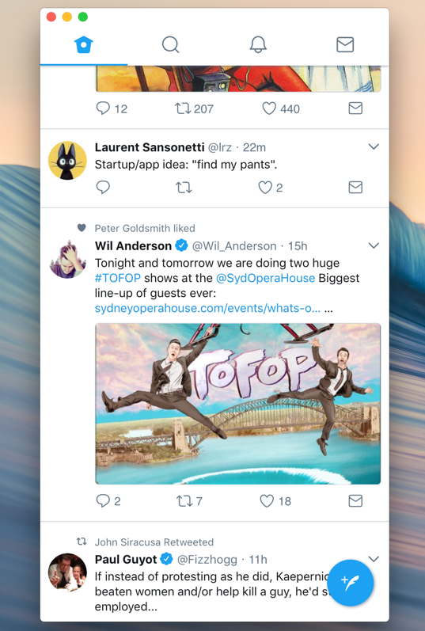

# Peep

Peep is a macOS Twitter client which is just a WKWebView pointed at http://mobile.twitter.com. This provides for a really good experience thanks to the engineers at Twitter who built Twitter Lite (https://blog.twitter.com/engineering/en_us/topics/open-source/2017/how-we-built-twitter-lite.html).

I was using Chirp (https://github.com/hanford/chirp) for a while, but it aims to be cross-platform and is therefore based on Electron. I just wanted something simple for macOS so I wrote this.

Peep uses the Muir icon set (http://pictogram.agency/muir/) from Sebastiaan de With (https://twitter.com/sdw).
